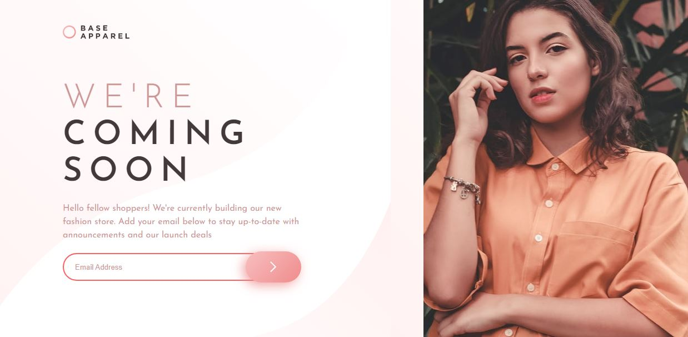
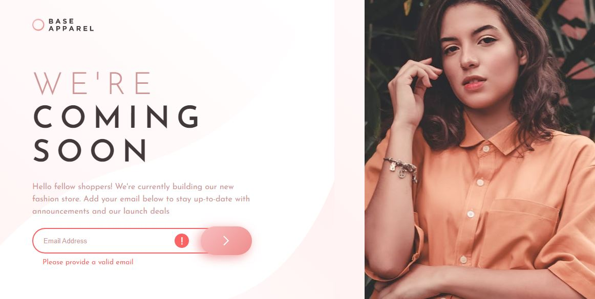
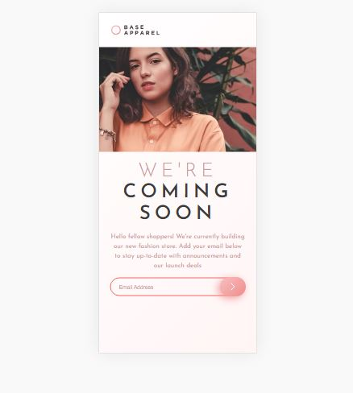

# Frontend Mentor - Base Apparel coming soon page solution

This is a solution to the [Base Apparel coming soon page challenge on Frontend Mentor](https://www.frontendmentor.io/challenges/base-apparel-coming-soon-page-5d46b47f8db8a7063f9331a0). Frontend Mentor challenges help you improve your coding skills by building realistic projects. 

## Table of contents

- [Frontend Mentor - Base Apparel coming soon page solution](#frontend-mentor---base-apparel-coming-soon-page-solution)
  - [Table of contents](#table-of-contents)
  - [Overview](#overview)
    - [The challenge](#the-challenge)
    - [Screenshot](#screenshot)
      - [Desktop](#desktop)
      - [Active States](#active-states)
      - [Mobile](#mobile)
    - [Links](#links)
  - [My process](#my-process)
    - [Built with](#built-with)
  - [Author](#author)

## Overview

### The challenge

Users should be able to:

- View the optimal layout for the site depending on their device's screen size
- See hover states for all interactive elements on the page
- Receive an error message when the `form` is submitted if:
  - The `input` field is empty
  - The email address is not formatted correctly

### Screenshot

#### Desktop

#### Active States

#### Mobile

### Links

- Solution URL: [Solution URL here](https://github.com/smartinsdev/apparel-coming-soon.git)
- Live Site URL: [Live site URL here](https://smartinsdev.github.io/apparel-coming-soon.git)

## My process

This project I separated into three blocks: the logo, the content, and the image. That way I can position the image below the logo when the device is mobile. In the desktop version I had some problems with the image, but in the end I think I got a good result.

### Built with

- Semantic HTML5 markup
- CSS custom properties
- Flexbox
- CSS Grid

## Author

- Frontend Mentor - [@smartinsdev](https://www.frontendmentor.io/profile/smartinsdev)
- Twitter - [@smartinsdev](https://www.twitter.com/smartinsdev)

